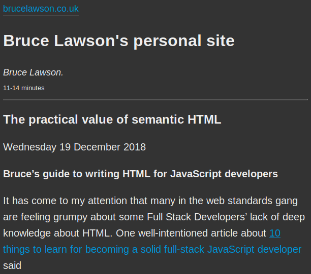
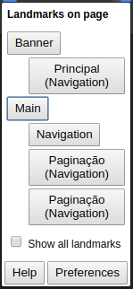
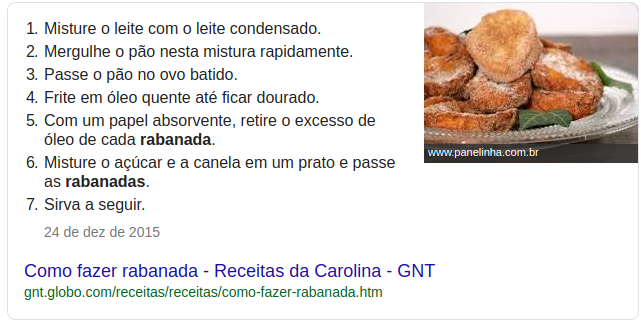
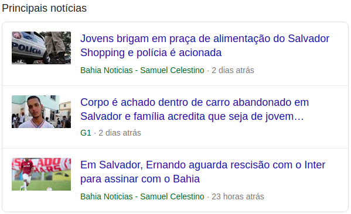
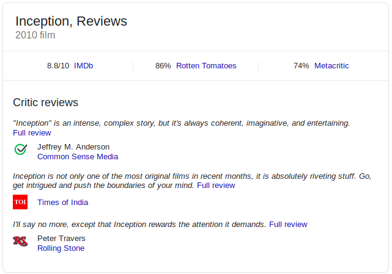
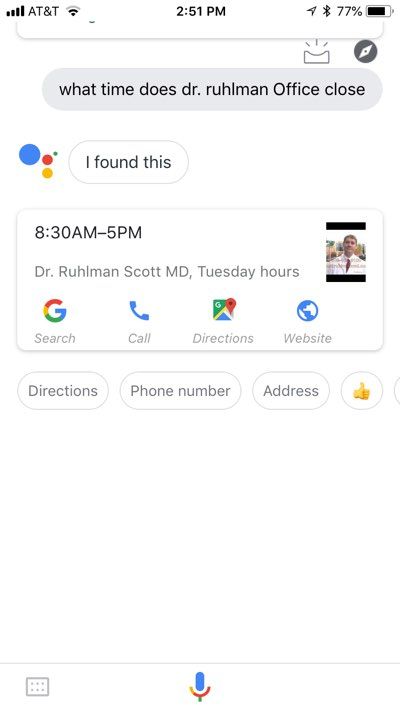
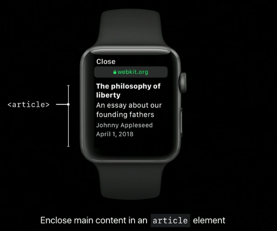
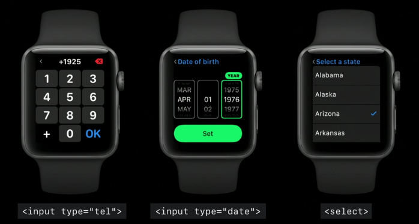
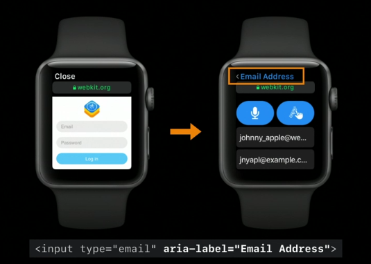

> Veja também minha [apresentação](https://jsisnottheweb-html.netlify.app/) sobre o mesmo tema.

Preencher formulários é frustrante o suficiente para que vários artigos tenham sido feitos sobre [como melhorar a experiência de preencher um](https://medium.com/@sympli/6-super-quick-ways-to-improve-the-ux-of-forms-9e0bf152b259) ou até [como convencer alguém a fazer isso](https://medium.com/@prashanth.mahadeva/making-people-fill-forms-8569cc273047). Pior ainda é aquele <i lang='en'>checkbox</i> de termos de privacidade no final de um formulário. Mas se existe justiça divina, existe alguma punição pra quem faz esse <i lang='en'>checkbox</i> sem uma <i lang='en'>label</i>, impedindo de clicar no texto pra marcar:

@[codesandbox](o-valor-pratico-do-html/not-nice-input)

Bastaria ter substituído o insignificante (porque sem significado) `<span>` por um `<label>` e meu dedo gordo não teria me impedido de marcar o <i lang='en'>checkbox</i> em meu celular e eu teria dado direito de venda sobre meus dados sem nem ler os termos:

@[codesandbox](o-valor-pratico-do-html/nice-input)

Uhu, todos felizes! 🎉

Essa e outras experiências frustrantes tem se tornado mais comuns, apesar de facilmente evitáveis. Ok, talvez isso seja porque eu me tornei um desenvolvedor paranoico que sempre checa se <i lang='en'>checkboxes</i> tem <i lang='en'>labels</i>, se apertar <kbd>Ctrl + Enter</kbd> submete formulários e se dá para navegar em um apenas com o teclado. Mas eu acho que não, e [não pareço estar sozinho](https://www.brucelawson.co.uk/2018/the-practical-value-of-semantic-html/): talvez desenvolvedores estejam menos interessados em se aprofundar em HTML.

Por quê? E quais seriam as vantagens de se aprofundar em HTML para eles? É o que tentarei responder nesse artigo.

## Como chegamos aqui

As quatro linguagens da Web são:

-   HTML
-   CSS
-   Javascript
-   WebAssembly 👶 (maravilhoso, mas completamente ignorado aqui)

Dessas, HTML descreve estrutura, CSS descreve estilo e Javascript adiciona animações e interatividade (a conhecida [separação de propósitos](https://pt.wikipedia.org/wiki/Separa%C3%A7%C3%A3o_de_conceitos)). Inicialmente, desenvolvedores web (ou web designers, lembra?) dedicavam igual atenção e esforço para as 3 linguagens. Javascript era vista como uma linguagem de programação simples para casos de uso simples, como validação de formulários. Era comum a ideia de que [<q>desenvolvedor <i lang='en'>front-end</i> não é programador</q>](https://www.webstoemp.com/blog/front-end-not-programming/).

À medida que Javascript incorporou novas funcionalidades e foi portado para novas plataformas (como <i lang='en'><a href="https://nodejs.org/">Node.js</a></i> no servidor e <i lang='en'><a href="http://johnny-five.io/">Johnny Five</a></i> em sistemas embarcados), a linguagem ganhou popularidade, foi adotada por outros nichos de desenvolvimento e se tornou mais complexa. Tornou-se mais comum gerar HTML e CSS com bibliotecas como <i lang='en'>React</i> e <i lang='en'>styled-components</i>. Empresas focam em Javascript em suas seleções e desenvolvedores se especializam apenas nela. A competição entre Web e plataformas nativas acentua a disparidade.

Assim se popularizou a ideia de que Javascript é a principal linguagem para desenvolvedores Web, enquanto HTML e CSS perderam prestígio. O exemplo abaixo ilustra a tendência:

> <q>As for HTML, there’s not much to learn right away and you can kind of learn as you go, but before making your first templates, know the difference between in-line elements like `<span>` and how they differ from block ones like `<div>`.</q>
>
> [10 things to learn for becoming a solid full-stack JavaScript developer](https://levelup.gitconnected.com/10-things-to-learn-for-becoming-a-solid-full-stack-javascript-developer-8b76467711ac)
>
> _Observação_: o objetivo não é criticar o autor, mas ilustrar a tendência

Então, num mundo de <i lang='en'>React</i> e <i lang='en'>CSS-in-JS</i>, qual é o valor de se aprofundar em HTML e CSS? Esse artigo vai ilustrar quando e como um conhecimento avançado em HTML é útil e aplicável. Veremos que ele:

1. Permite usar o melhor elemento em cada caso, fazendo uso das funcionalidades nativas do navegador e atendendo as expectativas dos usuários sobre como um botão, diálogo ou link devem funcionar
2. Permite que ferramentas extraiam estrutura, conteúdo e intenção de sua página e possam oferecer modos de acesso alternativos
3. Prepara nossos sites para dispositivos, plataformas e modos de acesso alternativos ou que ainda estão por vir

## HTML oferece uma base robusta

Frequentemente recriamos elementos nativos à mão, ou os usamos com um propósito diferente daquele para que ele foi feito. As razões variam: <i lang='en'>call-to-actions</i> que funcionam como links mas precisam parecer com botões acabam sendo implementados como `<button>` ou a impossibilidade de estilizar `<option>` nos impede de atender nossas especificações de design usando `<select>`, por exemplo.

Muitos desses casos podem ser evitados, mas existem casos legitimos. Ainda assim, esta tarefa é mais complexa do que parece, devido aos muitos comportamentos que o navegador garante para seus elementos interativos e à semântica desses elementos. Por exemplo: é esperado que campos de texto sejam focáveis e que certos atalhos de teclado funcionem neles (ex: <kbd>Ctrl + Z</kbd> desfaz a última mudança e <kbd>Ctrl + Enter</kbd> submete o formulário). Por isso, na maior parte das vezes a melhor opção é usar os elementos nativos e os estilizar.

Quais são as expectativas de comportamento e semântica dos elementos nativos? Nas seções a seguir, entraremos em mais detalhes para alguns deles:

### &lt;button>

<button class="button" style="all: revert" onclick='javascript:alert("Oi, eu sou o Goku!")'>Clique aqui</button>

`<button>` é um dos elementos interativos mais fundamentais da Web, junto com o `<a>` e o `<input>`. Ele também é um dos que mais tem implementações customizadas, frequentemente feitas com `<a>` ou `<div>` e quebrando as expectativas e comportamento de um botão. Por exemplo, se espera que eles:

-   Recebam foco e tenham seu estilo modificado
-   Sejam ativados com clique, <kbd>Enter</kbd> ou <kbd>Espaço</kbd>
    -   Quando ativados, `onclick` deve ser chamado
        -   ⚠️ Divs estilizados como botões só chamam quando clicados
        -   ⚠️ Links estilizados como botões não são ativados com Espaço
-   Anunciem que tem papel de button (`role="button"`) por padrão
    -   Exemplo de uso: leitores de tela
        -   ⚠️ Divs estilizados como botões não tem `role`, já que por definição `div` e `span` não tem significado
        -   ⚠️ Links estilizados como botões tem `role="link"`

Não é Essas expectativas não são difíceis de atender com um botão personalizado, mas é raro termos esses requisitos em mente quando o implementamos e o resultado disso é frustração para quem usa <i lang='en'>softwares</i> assistivos, para usuários avançados, etc. E por mais fácil que seja reimplementar botões continua mais fácil estilizá-los, principalmente se usarmos `all: unset`, uma única linha de CSS que reseta todo o estilo de um elemento e tem 87% de suporte global e 93% no Brasil, segundo o [Can I Use](https://caniuse.com/#feat=css-all).

Outros comportamentos que o navegador implementa para botões e que podem ser esperados por usuários:

-   Botões podem ser desabilitados com `disabled`
    -   Recebendo um estilo adequado
    -   Se tornando não-focáveis
    -   Se tornando não-interativos
-   Dentro de um formulários, botões podem submetê-lo ou resetá-lo

### &lt;dialog>

Diálogos e modais são comuns na web, usados para pedir confirmação do usuário, informar sobre erros ou te pedir pra se inscrever em mais uma <i lang='en'>newsletter</i> 🙄. Mas o que define um diálogo, um quadrado sobre o restante da página que você pode fechar?

Não exatamente, já que usuários tem diversas expectativas sobre o comportamento e semântica desses elementos:

-   Diálogos devem impedir o usuário de interagir com o restante da página. Isso implica:
    -   Que clicar ou tocar em elementos fora do diálogo não deve afetá-los
    -   Que não seja possível mover o foco para algo que esteja fora do diálogo
-   Devem fechar quando se clica fora deles, ou quando se pressiona <kbd>Esc</kbd>
-   Quando fechados, devem devolver foco para o último elemento focado antes do diálogo ser aberto
-   _Modais_ devem estar _sempre_ no topo, independente de `z-index`
-   Devem receber `role="dialog"` ou `role="alertdialog"`

Quantos desses requisitos a sua implementação de modal atende?

Eu sei de duas implementações que atendem esses (menos o 3º 🤫): a do navegador (`<dialog>`) e a do <i lang='en'><a href="https://github.com/GoogleChrome/dialog-polyfill">polyfill</a></i>. Sendo uma adição recente à especificação do HTML, seu [suporte ainda não é ideal](https://caniuse.com/#feat=dialog), mas, com o <i lang='en'>polyfill</i>, você já pode usar hoje um elemento nativo de diálogo que oferece uma ótima expêriencia de base para seus usuários, e pode assim focar em desenvolver o seu produto.

### &lt;a>

Links são tão relevantes para a web hoje quanto eram quando ela foi criada: com a quantidade de tráfego que mecanismos de busca podem prover, <i lang='en'><abbr title="search engine optimization">SEO</abbr></i> é um alvo para grande parte dos sites comerciais - e links são fundamentais para ele. Bots de mecanismos de busca não contabilizam como links aqueles feitos com `<button onclick='javascript:location.href = "about"'>` (ou qualquer outro elemento que não seja `<a>`), não contribuindo para o seu posicionamento.

Assim como essa, existem outras funcionalidades e características de links que não podem ser reproduzidas com outros elementos. Alguns deles:

-   Menu contextual e atalhos de teclado permitem:
    -   Abrir o link em nova aba
    -   Copiar a URL
    -   Favoritar e salvar
    -   Outras interações que venham de extensões (ex: para uma extensão do Google Translate, <q>traduzir link</q>)
-   Permitem definir diferentes estilos para links já visitados, ativos, etc
-   Permitem expressar a relação entre páginas com `rel`, por exemplo:
    -   `rel="me"` indica que as duas páginas pertencem e se referem à mesma entidade (ex: site de empresa e perfil em mídia social)
    -   `rel="alternate"` indica que as duas páginas são análogas e tem conteúdo semelhante (ex: `<a hreflang="es" rel="alternate">Veja essa página em espanhol</a>`)
-   Permitem baixar o conteúdo do link ao invés de acessá-lo, através do atributo `download`

Outras expectativas de usuário são que links:

-   Devem receber foco e ter seu estilo modificado
-   Devem ser ativados com clique ou Enter
-   Costumam ter <u>underline</u> e diferentes estilos pra diferentes estados

---

Portanto, ao implementar um botão, link, diálogo, accordion, campo de texto e outros, devemos nos perguntar se o HTML tem um elemento para isso. Se tiver, devemos avaliar se ele atende as nossas necssidades (se pode ser estilizado, etc). Se atende, problema resolvido. Se não existe ou não atende, devemos ter em mente quais expectativas usuários tem sobre aquele elemento e devemos reproduzí-las tão fielmente quanto possível.

A melhor opção pode ser usar o que o navegador já nos dá. 😉

## HTML semântico possibilita análise de máquina

Falamos há pouco de bots de mecanismo de busca, que analisam o conteúdo de nossas páginas buscando extrair conexões entre páginas, se elas são responsivas, se elas são lentas ou pesadas, etc. De forma mais geral, podemos dizer que eles fazem análise de máquina - e não são os únicos. Mídias sociais mostram cards com informações como título, descrição, foto, data de publicação e autor quando compartilhamos links nelas. Serviços, como o Pocket e o Instapaper, e navegadores, como o Firefox e o Safari, oferecem modos de leitura, em que exibem metadados semelhantes, acrescentando também o conteúdo extraído da página. Mecanismos de busca também exibem diversos tipos de cards, que enumeram notícias relacionadas a um tema, mostram o passo a passo de uma receita ou endereço e telefone de uma organização.

E o que permite que tudo isso seja bem feito é HTML semântico com dados estruturados.

### HTML semântico

Dizemos que um HTML é semântico quando, para cada conteúdo, ele usa o elemento que melhor aproxima seu signficado. Isso significa usar:

-   `<ul>` ou `<ol>` para listas e enumerações
-   `<table>` para tabelas (e só para tabelas, né [Hacker News](https://news.ycombinator.com/)?)
-   `<button>` para botões
-   `<a>` para links
-   Para campos de texto, usar um `<input>` com o atributo `type` mais adequado (`tel`, `email`, `number`, `range`, etc)
-   Para o label de um `<input>`, `<textarea>` ou `<select>`, usar um `<label>`
-   Se atentar a semântica textual:
    -   `<strong>` vs `<b>`
    -   `<em>` vs `<i>`
    -   `<mark>`, `<q>`, `<cite>`, etc

Essa lista não é exaustiva e muitos dos mais de 100 elementos HTML não foram citados. Para saber mais, existem recursos como o [MDN](https://developer.mozilla.org/) e o [HTML Reference](https://htmlreference.io/). Alguns dos elementos não citados são o chamados [elementos de separação de conteúdo](https://developer.mozilla.org/pt-BR/docs/Web/HTML/Element#Separa%C3%A7%C3%A3o_de_conte%C3%BAdo) ou <i lang='en'>landmarks</i>, que permitem organizar o conteúdo de uma página em partes lógicas, como cabeçalho, rodapé, seção principal, navegação e outros. Alguns deles:

-   `<section>` para seções genéricas. Para seções com significados mais específicos, temos:
    -   `<main>`, para o conteúdo principal da página. Só pode haver um por página
    -   `<aside>`, para conteúdo secundário, geralmente barras laterais
    -   `<nav>`, para navegação
    -   `<body>` também define uma seção
-   `<header>` e `<footer>` para cabeçalhos e rodapés de uma seção, respectivamente
-   De `<h1>` a `<h6>`, para a estrutura de tópicos de um conteúdo (essas customTags podem ser usadas para gerar o índice sumário de uma página, por exemplo)
-   `<address>`, para informações de contato

Eles são especialmente importantes para a extração de conteúdo e navegação com tecnologias assistivas, como nos exemplos a seguir:



<div class="img-caption">Modo de leitura do Firefox</div>


<div class="img-caption">Artigo no Pocket</div>



<div class="img-caption">
	Outline de página baseado em <i lang="en">landmarks</i>
</div>


<div class="img-caption">Leitura rápida do Telegram</div>

### Dados estruturados

O vocabulário dos elementos HTML é útil, mas bastante limitado. Ele nos permite declarar qual é a _estrutura_ da página, mas não identificar o _significado_ do conteúdo de elementos ou a relação entre eles. Sem isso, mecanismos de busca não podem exibir o telefone de uma empresa e mídias sociais não teriam <i lang='en'>cards</i> com titulo, data de publicação, autor, foto, etc. Para suprir essas necessidades, foram criados vocabulários de metadados (como o [schema.org](https://schema.org/)) e formas de adicionar esses metadados no HTML (como o [Microdata](https://developer.mozilla.org/en-US/docs/Web/HTML/Microdata) e o [JSON-LD](https://json-ld.org/)).

Vocabulários são coleções de tipos (como [Person](https://schema.org/Person) e [BlogPosting](https://schema.org/BlogPosting)) que definem as propriedades que esperam ([birthDate](https://schema.org/birthDate), [children](https://schema.org/children) e [jobTitle](https://schema.org/jobTitle) são propriedades do tipo Person) e qual é o tipo de cada (birthDate tem o tipo [Date](https://schema.org/Date)). Eles são, de fato, um vocabulário com que podemos descrever o conteúdo de nossas páginas.

Já Microdata define como inserir esse vocabulário no HTML e o faz através de 5 atributos:

-   `itemid` é um ID único para aquele item
-   `itemprop` define uma propriedade de um item
-   `itemtype` define o tipo do conteúdo de um elemento a partir da URL dele (`itemtype=https://schema.org/Person`)
-   `itemscope`, quando presente, determina que os filhos de um elemento são sobre o item atual
-   `itemref` aceita uma lista de ids (não `itemid`!) e permite declarar a que `itemscope` ele se refere

Por exemplo:

```html
<article itemtype="https://schema.org/BlogPosting" itemscope>
	<header>
		<a href="/meu-blog-post" itemprop="url">
			<h2 itemprop="headline">Meu blog post</h2>
		</a>
		<div itemprop="author" itemscope itemtype="https://schema.org/Person">
			Por <span itemprop="name">João Santana</span>
		</div>
	</header>

	<section>
		<div class="lead" itemprop="alternativeHeadline">Não deixe de ler meu blog</div>

		<p itemprop="text">Blablabla</p>
	</section>
</article>
```

Páginas que usam dados estruturados são mais legíveis para máquinas e permitem coisas como:



<div class="img-caption">Busca por receita no Google</div>



<div class="img-caption">Busca por notícias no Google</div>



<div class="img-caption">Busca por filme no Google</div>



<div class="img-caption">Resposta do Google Assistant</div>

Para saber mais, eu recomendo o [guia do Google sobre dados estruturados](https://developers.google.com/search/docs/guides/intro-structured-data), que é completo, cheio de exemplos e oferece até um validador.

## HTML semântico é resiliente

HTML é um padrão aberto associado à Web, uma plataforma aberta que tem como princípio fundamental ser retrocompatível. Essa definição carregada traz duas consequências relevantes:

-   Sendo a Web aberta, baseada em padrões abertos e desassociada de qualquer plataforma ou dispositivo em particular, a Web estará presente em dispositivos e plataformas do futuro
-   Os padrões estáveis de hoje continuarão funcionando nesse futuro

Implementadores de navegadores, dispositivos, plataformas, ferramentas de desenvolvimento e ferramentas de acessibilidade, sabendo dessa estabilidade, fazem uso da semântica do HTML, do [<abbr title="Accessible Rich Internet Applications">ARIA</abbr>](https://developer.mozilla.org/en-US/docs/Web/Accessibility/ARIA) e de dados estruturados ao inovar, e continuarão fazendo. É por isso que HTML semântico:

### Está pronto para dispositivos e ferramentas futuros

Relógios, carros e <i lang='en'>headsets</i> de realidade virtual já tem navegadores e cada um deles, com seu formato e suas particularidades, impõe novas limitações e abre novas possibilidades sobre como interagir com a Web. O tamanho reduzido da tela do <i lang='en'>Apple Watch</i> impõe limitações severas de usabilidade – ler é difícil, clicar é difícil – e o modo de leitura é uma solução elegante que está disponível para sites que tenham sido feitos com HTML semântico. Bruce Lawson descreve melhor do que eu:

> <q>I didn’t choose to use &lt;article> and `itemprop` and input types because I wanted to support the Apple Watch; I did it before the Apple Watch existed, in order that my code is future-proof. By choosing the right semantics now, a machine that I don’t know about yet can understand my content and display it in the best way for its users</q>
>
> Bruce Lawson em [The practical value of semantic HTML](https://www.brucelawson.co.uk/2018/the-practical-value-of-semantic-html/)

Alguns exemplos disso, no Apple Watch:



<div class="img-caption">Modo de leitura</div>


<div class="img-caption">Exibição de figure</div>



<div class="img-caption">Diferentes tipos de input</div>



<div class="img-caption">Exibição de input com label</div>

Como será um botão num navegador de realidade virtual daqui a 5 anos? Quanto tempo até a <i lang='en'>Alexa</i> ou o <i lang='en'>Google Home</i> lerem a Web? Será que navegadores vão oferecer sumários de páginas, como fazem hoje alguns leitores de tela? Usando HTML semântico e outros padrões, podemos deixar a decisão de qual é a melhor forma de expor esses elementos com o navegador e estar preparados desde já.

Além de navegadores e outros <i lang='en'><a href="https://en.wikipedia.org/wiki/User_agent">user agents</a></i>, ferramentas que geram ou interagem com HTML também podem se beneficiar de um HTML semântico. Como exemplo, o [React](https://reactjs.org/) vai reduzir a prioridade de renderização de elementos que tenham o atributo `hidden` do HTML 5 e de toda a sua sub-árvore, renderizando primeiro o conteúdo visível:

> <q>when a HTML component sets the hidden={true} property, React will automatically change the priority of this subtree so that it won’t be part of the initial render. The idea is to e.g have a tab component that can render out every window in advance so switching tabs is super fast but it only needs to display the first tab’s content in the initial render so the hidden tabs can be deprioritized</q>
>
> Do repositório sobre Concurrent React, [página](https://github.com/sw-yx/fresh-concurrent-react/blob/master/apis/hidden.md) sobre `hidden={true}`

É isso o que HTML é, afinal de contas: um vocabulário comum que contem os principais elementos interativos, tipográficos e de separação de conteúdo (acha que falta algum? manda sua ideia pro [discourse do WICG](https://discourse.wicg.io/) e [contribua você também para a Web](https://medium.com/dev-channel/engaging-in-web-standards-the-compatible-with-most-web-developers-approach-eae5f624a5b7)). Ao usar esse vocabulário tão bem quanto possível, nossos dispositivos e ferramentas ficam bem informados e podem oferecer a melhor experiência para o seu usuário, de acordo com o elemento, o [fator de forma](<https://en.wikipedia.org/wiki/Form_factor_(design)>) do dispositivo e outras limitações.

### Tem valor para quem não usa a Web como você

Nem todo mundo usa a Web como você. Talvez não você saiba, ou talvez você ache que isso não é relevante para o seu nicho de mercado. Vamos tratar das duas hipóteses aqui.

Eu acesso a Web com um navegador, usando teclado e mouse ou tela sensível ao toque, a partir de um computador ou celular e com uma conexão de razoável. Mas eu erraria ao supor que todos acessam nossos sites nessas condições. Afinal, nem todos os acessam:

-   A partir de um navegador (ex: Pocket, <i lang='en'>Google Assistant</i>, <i lang='en'>widgets</i> de mecanismos de busca)
-   A partir de um computador, celular ou tablet (ex: <i lang='en'>Apple Watch</i>, <i lang='en'>smart TVs</i>)
-   Usando ou mouse e teclado ou uma tela sensível ao toque
-   Visualmente (ex: leitores de tela e, quem sabe no futuro, a Alexa)
-   Com uma conexão rápida (tamanho de <i lang='en'>bundle</i> também é acessibilidade)

Segundo estimativas da <abbr title="Organização mundial da saúde" aria-label="Organização mundial da saúde">OMS</abbr> publicadas em um [relatório de 2011](https://www.who.int/disabilities/world_report/2011/report/en/), 15% da população mundial convive com pelo menos uma forma de deficiência. Vale dizem também que aqueles de nós que não tem deficiências, [não as tem apenas temporariamente](https://www.invisionapp.com/inside-design/accessibility-design-for-the-future/), e que [acessibilidade não é o que se costuma pensar](https://boagworld.com/accessibility/accessibility -is-not-what-you-think/) (acessibilidade é fazer para todos, não fazer para poucos) e o que beneficia o usuário com baixa acuidade visual também beneficia quem usa seu site pelo celular na rua, no sol de meio-dia de Salvador.

As ferramentas que proveem modos de acesso alternativos à Web o fazem usando HTML semântico, ARIA e dados estruturados para extrair estrutura, conteúdo e intenção. Se atentar a esses padrões significa que damos acesso a uma maior parte da população, em uma maior gama de modos de acesso; e significa também estar preparados para modos de acesso que ainda não foram concebidos ou popularizados. Vale lembrar que muitas tecnologias que hoje são populares em toda a população [começaram como pesquisa em acessibilidade](https://www.youtube.com/watch?v=T2CjuAwrAq8), como o reconhecimento e sintetização de voz que hoje são a base dos assistentes de voz.

Além disso, supor que pessoas com deficiência não são o seu nicho de mercado é apenas isso: uma suposição. Na era das <i lang='en'>data-driven decisions</i>, esperaria-se que validássemos isso comparando o <i lang='en'>bounce</i> ou <i lang='en'>churn rate</i> dos dois segmentos, mas [isso pode não ser possível](https://www.mightybytes.com/blog/how-many-users-with-disabilities-on-site/), já que pessoas com deficiência tem direito a manter isso em segredo e, portanto, navegadores não expoem essa infomação e ela não vai parar no seu <i lang='en'>analytics</i>.

## Conclusão

Espero ter podido mostrar como HTML continua sendo uma habilidade essencial para o desenvolvedor Web, como essa habilidade te será útil e mostrar alguns recursos pra aprimorá-la. Os principais pontos foram:

-   Você começar da base que o HTML te dá, ou começar do zero. Em geral, a primeira opção é a melhor
-   HTML semântico e dados estruturados te permitem expressar forma e conteúdo de uma forma inteligível por bots e <i lang='en'>crawlers</i>, melhorando o seu SEO e permitindo novas formas de interação com o seu site
-   HTML semântico é resiliente porque descreve sem prescrever, delegando ao <i lang='en'>user agent</i> a decisão de como expor aquele elemento
    -   Por isso, HTML semântico dá acesso a quem não teria pleno acesso apenas com um navegador
